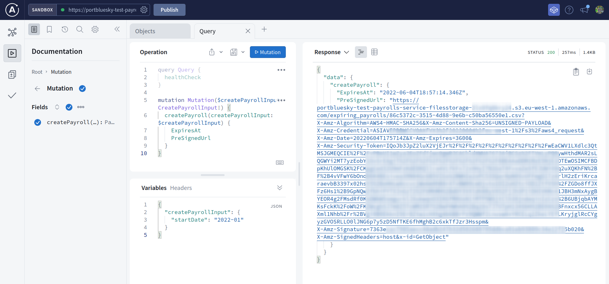
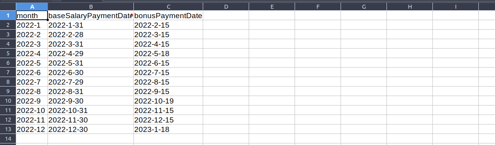
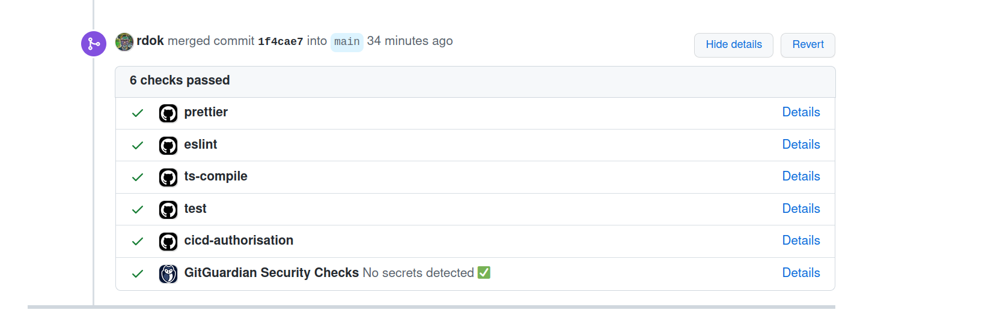
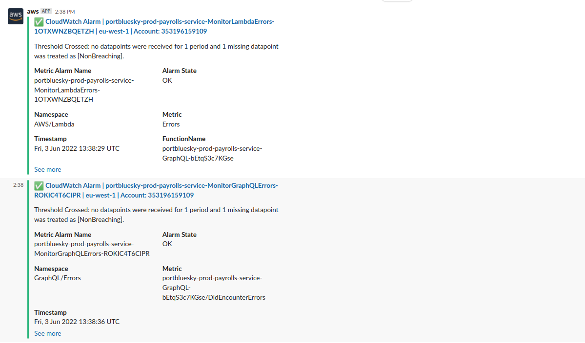
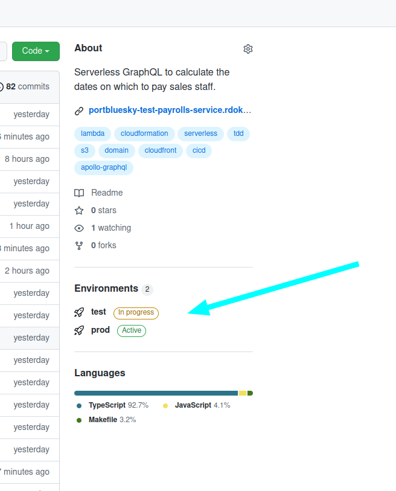

# payrolls-service
[![Deploy][badge_svg_deploy]][workflow_link_deploy]
[![Check][badge_svg_check]][workflow_link_check]

> Generates company payrolls. Serverless GraphQL to calculate the dates on which to pay sales staff.
 
# Acceptance Criteria

- Sales staff are paid a regular fixed base salary each month, plus a regular monthly bonus.
- Base salaries are paid on the last day of each month, unless that day is a Saturday or Sunday (a weekend), in which case they are paid on the Friday before the weekend
- On the 15th of each month, bonuses are paid for the previous month, unless that day is a weekend, in which case they are paid on the first Wednesday after the 15th.
- Accept a date as a parameter, and return the payment dates for the following 12 months, including the supplied date. Results should be returned in CSV format.
- The API is consumed a browser-based company intranet, written in a frontend framework such as React.


# cURL GraphQL Request - Production Environment

```
curl --request POST \
  --header 'content-type: application/json' \
  --url 'https://portbluesky-prod-payrolls-service.rdok.co.uk/graphql' \
  --data-raw '{"query":"mutation Mutation($createPayrollInput: CreatePayrollInput!) {  createPayroll(createPayrollInput: $createPayrollInput) {    ExpiresAt    PreSignedUrl  }}","variables":{"createPayrollInput":{"startDate":"2022-01"}},"operationName":"Mutation"}'
```


# Features






- Run `make` for local development and to view the GraphQL schema in Apollo Studio
- Compiles NodeJS TypeScript to JS for AWS Lambda.
- Uses SAM template to create API Gateway, Lambda function with GraphQL
- Unit tests the Lambda handlers & libraries.
- Runs CI/CD pipelines through GitHub Actions.
- [Grants the least privileges](https://docs.aws.amazon.com/IAM/latest/UserGuide/best-practices.html#grant-least-privilege) CI/CD security best practise; through AWS CDK unit tested.
- [Delegates permissions through role](https://docs.aws.amazon.com/IAM/latest/UserGuide/best-practices.html#delegate-using-roles) CI/CD security best practise; through AWS CDK unit tested.
- Rapidly deploys dev stack locally through Makefile commands
- Automates dependency updates for NPM packages.
- Automates dependency updates for GitHub actions dependencies.
- Reuses CI checks through [reusable GitHub workflows](https://docs.github.com/en/actions/learn-github-actions/reusing-workflows)
- Ensures [![Deploy][badge_svg_deploy]][workflow_link_deploy] workflow runs at a time through GitHub's [concurrency](https://docs.github.com/en/actions/learn-github-actions/workflow-syntax-for-github-actions#concurrency) feature.
- Restricts NodeJS engine version to 16, same as AWS Lambda
- Disables Apollo Studio on production environment.

[use_this_template]: https://github.com/rdok/portbluesky_payrolls-service/generate
[badge_svg_deploy]: https://github.com/rdok/portbluesky_payrolls-service/actions/workflows/deploy.yml/badge.svg?branch=main
[badge_svg_check]: https://github.com/rdok/portbluesky_payrolls-service/actions/workflows/check.yml/badge.svg
[workflow_link_deploy]: https://github.com/rdok/portbluesky_payrolls-service/actions/workflows/deploy.yml
[workflow_link_check]: https://github.com/rdok/portbluesky_payrolls-service/actions/workflows/check.yml
