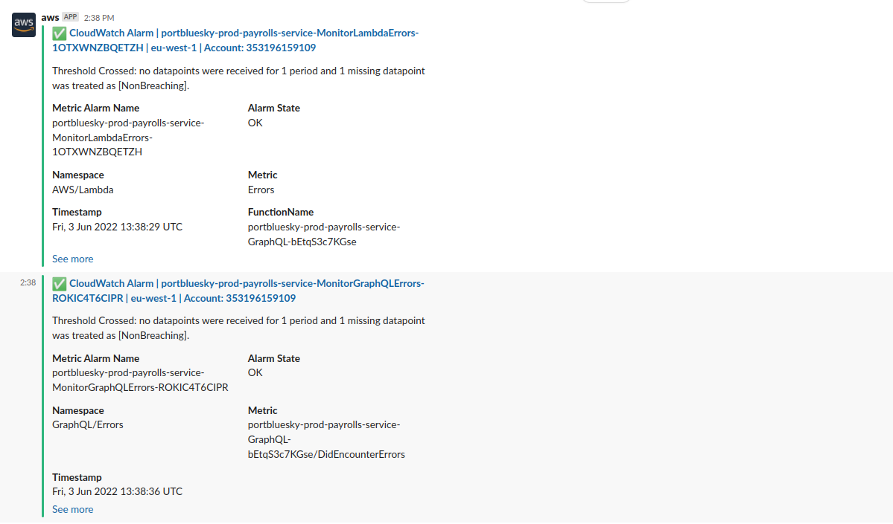

# payrolls-service

[![Deploy][badge_svg_deploy]][workflow_link_deploy]
[![Check][badge_svg_check]][workflow_link_check]

# TODO

- Request from client the website domain which will consume this API. Add said domain to CORS.

# Features

- Run `make` for local development and to view the GraphQL schema in Apollo Studio
- API is guarded using IAM authoriser; private APIs. Use Postman with AWS Signature Authorisation to access test or production environments.
- Compiles NodeJS TypeScript to JS for AWS Lambda.
- Uses SAM template to create API Gateway, Lambda function with GraphQL
- Unit tests the Lambda handlers & libraries.
- Runs CI/CD pipelines through GitHub Actions.
- [Grants the least privileges](https://docs.aws.amazon.com/IAM/latest/UserGuide/best-practices.html#grant-least-privilege) CI/CD security best practise; through AWS CDK unit tested.
- [Delegates permissions through role](https://docs.aws.amazon.com/IAM/latest/UserGuide/best-practices.html#delegate-using-roles) CI/CD security best practise; through AWS CDK unit tested.
- Rapidly deploys dev stack locally through Makefile commands
- Automates dependency updates for NPM packages.
- Automates dependency updates for GitHub actions dependencies.
- Reuses CI checks through [reusable GitHub workflows](https://docs.github.com/en/actions/learn-github-actions/reusing-workflows)
- Ensures [![Deploy][badge_svg_deploy]][workflow_link_deploy] workflow runs at a time through GitHub's [concurrency](https://docs.github.com/en/actions/learn-github-actions/workflow-syntax-for-github-actions#concurrency) feature.
- Restricts NodeJS engine version to 14, same as AWS Lambda
- Disables Apollo Studio on production environment.

[use_this_template]: https://github.com/rdok/portbluesky_payrolls-service/generate
[badge_svg_deploy]: https://github.com/rdok/portbluesky_payrolls-service/actions/workflows/deploy.yml/badge.svg?branch=main
[badge_svg_check]: https://github.com/rdok/portbluesky_payrolls-service/actions/workflows/check.yml/badge.svg
[workflow_link_deploy]: https://github.com/rdok/portbluesky_payrolls-service/actions/workflows/deploy.yml
[workflow_link_check]: https://github.com/rdok/portbluesky_payrolls-service/actions/workflows/check.yml
